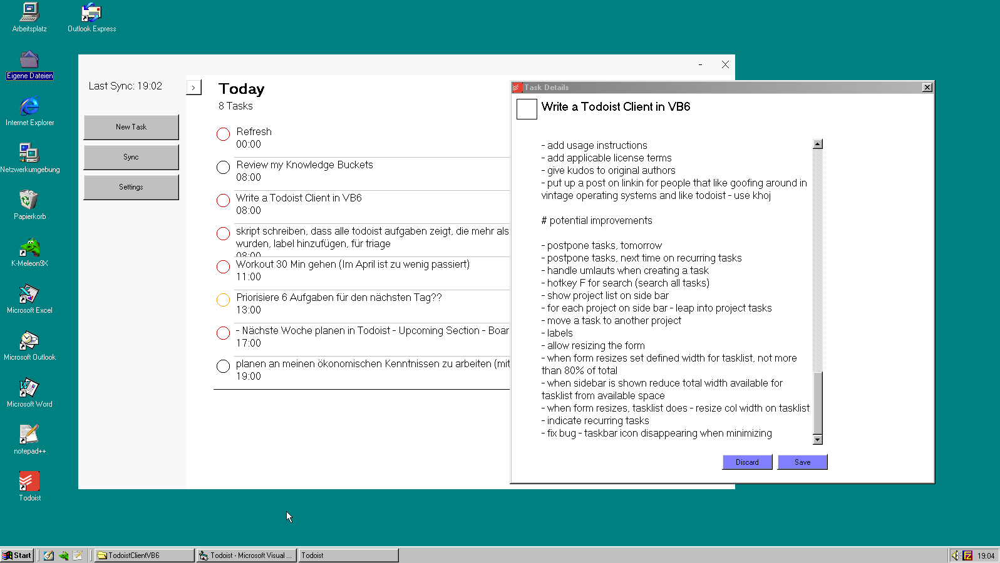

# Yet Another Todoist Clone (YATC)

A Todoist Clone written in Visual Basic 6 with full Windows 98 support!

This is a fun project - made by a Todoist user - not affiliated with Todoist

# Features
- persist the API token and proxy address to file✅
- priorities in colors✅
- add a task from VB6✅
- sync changed tasks on the server on startup and using a timer✅
- handle umlauts - sync down✅
- open close side menu with hotkey✅
- hotkey for new task✅
- msflexgrid Multiline with Date, Date in Format hh:mm✅
- msflexgrid align text left✅
- show task description dialog on click✅
- sync with S hotkey✅
- allow to complete tasks✅
- modern UI title bar buttons✅

# Potential Improvements
- postpone tasks to tomorrow and next time on recurring tasks
- handle umlauts when creating a task
- hotkey F for search across all tasks
- show project list on side bar
- for each project on side bar - leap into project tasks
- move a task to another project
- labels
- allow resizing the form
- when form resizes set defined width for tasklist, not more than 80% of total
- indicate recurring tasks
- fix bug - taskbar icon disappearing when minimizing

# Getting Started
To get this application running download the stable release. This will run on Windows 11 as well. Before starting make sure to register the used control, MSFlexGrid
```
regsvr32 MSFLXGRD.OCX
```

This application uses a Todoist API Token. You can generate one yourself:
Todoist Settings > Integrations > Manage Apps
Create an application
Extract the API Token

Since this application is build using Visual Basic the TLS support is limited. You will need a local http to https proxy to make the connection to the Todoist servers work. Here is my version I forked and made it to work seamlessly in the background https://github.com/renezander030/http-to-https-proxy.

# Building
To build this application you will need Visual Basic 6. Fork this repository, clone it and get building!

# Kudos
to yeokm1 for the proxy portion
to wqweto for the JSON parser

# Licensing
Everything here built by myself you can use freely any way you like following the MIT-license.

MIT License

Copyright (c) 2025 Rene Zander

Permission is hereby granted, free of charge, to any person obtaining a copy
of this software and associated documentation files (the "Software"), to deal
in the Software without restriction, including without limitation the rights
to use, copy, modify, merge, publish, distribute, sublicense, and/or sell
copies of the Software, and to permit persons to whom the Software is
furnished to do so, subject to the following conditions:

The above copyright notice and this permission notice shall be included in all
copies or substantial portions of the Software.

THE SOFTWARE IS PROVIDED "AS IS", WITHOUT WARRANTY OF ANY KIND, EXPRESS OR
IMPLIED, INCLUDING BUT NOT LIMITED TO THE WARRANTIES OF MERCHANTABILITY,
FITNESS FOR A PARTICULAR PURPOSE AND NONINFRINGEMENT. IN NO EVENT SHALL THE
AUTHORS OR COPYRIGHT HOLDERS BE LIABLE FOR ANY CLAIM, DAMAGES OR OTHER
LIABILITY, WHETHER IN AN ACTION OF CONTRACT, TORT OR OTHERWISE, ARISING FROM,
OUT OF OR IN CONNECTION WITH THE SOFTWARE OR THE USE OR OTHER DEALINGS IN THE
SOFTWARE.